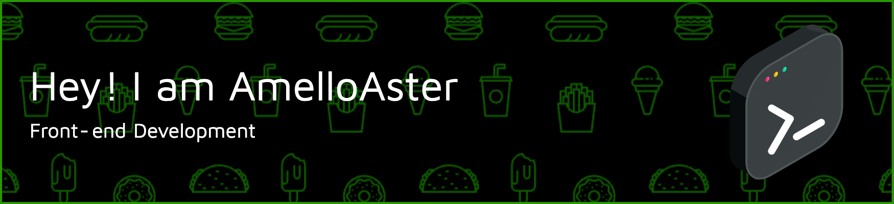

Hello , welcome to my github I am AmelloAster and I tried most fields of programming such as web design and development, mobile application development, etc., and finally I was able to find my interest, and that was web design and development and security . It has been almost 5 years.
And I like to explore and adventure, like to contact and learn new things, I like to constantly solve the problems found

<h3 align="left">Connect with me:</h3>

<div align="left" style="display:flex;gap:12px;">
  
[](https://www.instagram.com/AmelloAster69/)
[](https://www.twitter.com/AmelloAster/)
[](https://damagedcode.vercel.app/)
[](https://github.com/AmelloAster/)

</div>  

<h3 align="left">Languages and Tools:</h3>
<p align="left"> <a href="https://angular.io" target="_blank" rel="noreferrer">  </a> <a href="https://azure.microsoft.com/en-in/" target="_blank" rel="noreferrer">  </a> <a href="https://babeljs.io/" target="_blank" rel="noreferrer">  </a> <a href="https://www.w3schools.com/css/" target="_blank" rel="noreferrer">  </a> <a href="https://d3js.org/" target="_blank" rel="noreferrer">  </a> <a href="https://www.figma.com/" target="_blank" rel="noreferrer">  </a> <a href="https://www.gatsbyjs.com/" target="_blank" rel="noreferrer">  </a> <a href="https://git-scm.com/" target="_blank" rel="noreferrer">  </a> <a href="https://graphql.org" target="_blank" rel="noreferrer">  </a> <a href="https://www.w3.org/html/" target="_blank" rel="noreferrer">  </a> <a href="https://ionicframework.com" target="_blank" rel="noreferrer">  </a> <a href="https://developer.mozilla.org/en-US/docs/Web/JavaScript" target="_blank" rel="noreferrer">  </a> <a href="https://jestjs.io" target="_blank" rel="noreferrer">  </a> <a href="https://www.mongodb.com/" target="_blank" rel="noreferrer">  </a> <a href="https://nextjs.org/" target="_blank" rel="noreferrer">  </a> <a href="https://www.nginx.com" target="_blank" rel="noreferrer">  </a> <a href="https://nodejs.org" target="_blank" rel="noreferrer">  </a> <a href="https://postman.com" target="_blank" rel="noreferrer">  </a> <a href="https://reactjs.org/" target="_blank" rel="noreferrer">  </a> <a href="https://reactnative.dev/" target="_blank" rel="noreferrer">  </a> <a href="https://redux.js.org" target="_blank" rel="noreferrer">  </a> <a href="https://www.rust-lang.org" target="_blank" rel="noreferrer">  </a> <a href="https://sass-lang.com" target="_blank" rel="noreferrer">  </a> <a href="https://svelte.dev" target="_blank" rel="noreferrer">  </a> <a href="https://tailwindcss.com/" target="_blank" rel="noreferrer">  </a> <a href="https://www.typescriptlang.org/" target="_blank" rel="noreferrer">  </a> <a href="https://vuejs.org/" target="_blank" rel="noreferrer">  </a> <a href="https://webpack.js.org" target="_blank" rel="noreferrer">  </a> </p>

<!--START_SECTION:waka-->


**🐱 My GitHub Data** 

> 🏆 240 Contributions in the Year 2022
 > 
> 📦 20.1 kB Used in GitHub's Storage 
 > 
> 🚫 Not Opted to Hire
 > 
> 📜 26 Public Repositories 
 > 
> 🔑 0 Private Repositories  
 > 
**I'm a Night 🦉** 

```text
🌞 Morning    14 commits     ██░░░░░░░░░░░░░░░░░░░░░░░   11.2% 
🌆 Daytime    44 commits     ████████░░░░░░░░░░░░░░░░░   35.2% 
🌃 Evening    50 commits     ██████████░░░░░░░░░░░░░░░   40.0% 
🌙 Night      17 commits     ███░░░░░░░░░░░░░░░░░░░░░░   13.6%

```
📅 **I'm Most Productive on Saturday** 

```text
Monday       20 commits     ████░░░░░░░░░░░░░░░░░░░░░   16.0% 
Tuesday      21 commits     ████░░░░░░░░░░░░░░░░░░░░░   16.8% 
Wednesday    7 commits      █░░░░░░░░░░░░░░░░░░░░░░░░   5.6% 
Thursday     23 commits     ████░░░░░░░░░░░░░░░░░░░░░   18.4% 
Friday       14 commits     ██░░░░░░░░░░░░░░░░░░░░░░░   11.2% 
Saturday     25 commits     █████░░░░░░░░░░░░░░░░░░░░   20.0% 
Sunday       15 commits     ███░░░░░░░░░░░░░░░░░░░░░░   12.0%

```


📊 **This Week I Spent My Time On** 

```text
⌚︎ Time Zone: Asia/Shanghai

💬 Programming Languages: 
TypeScript               10 hrs 40 mins      █████████░░░░░░░░░░░░░░░░   36.16% 
JavaScript               10 hrs 34 mins      █████████░░░░░░░░░░░░░░░░   35.82% 
Vue.js                   4 hrs 22 mins       ███░░░░░░░░░░░░░░░░░░░░░░   14.82% 
SCSS                     1 hr 2 mins         █░░░░░░░░░░░░░░░░░░░░░░░░   3.52% 
JSON                     49 mins             ░░░░░░░░░░░░░░░░░░░░░░░░░   2.78%

🔥 Editors: 
VS Code                  29 hrs 32 mins      █████████████████████████   100.0%

💻 Operating System: 
Mac                      29 hrs 32 mins      █████████████████████████   100.0%

```

**I Mostly Code in TypeScript** 

```text
TypeScript               7 repos             █████████████████░░░░░░░░   70.0% 
CSS                      1 repo              ██░░░░░░░░░░░░░░░░░░░░░░░   10.0% 
Svelte                   1 repo              ██░░░░░░░░░░░░░░░░░░░░░░░   10.0% 
Lua                      1 repo              ██░░░░░░░░░░░░░░░░░░░░░░░   10.0%

```


 Last Updated on 25/10/2022 01:30:28 UTC
<!--END_SECTION:waka-->

&nbsp;
&nbsp;
## Github stats 📊 

<details> 
  <summary>GitHub Profile Stats 💻</summary>
  <br/>
    <div style="display:flex;justify-content: space-between;align-items: center;">
    <a href="https://github.com/anuraghazra/github-readme-stats"></a>
  <a href="https://github.com/anuraghazra/github-readme-stats"></a></div>
  <br/>
</details>

<details>
  <summary>Activity Graph 📈</summary>
  <br/>
<a href="https://github.com/ashutosh00710/github-readme-activity-graph"></a>
</details>
